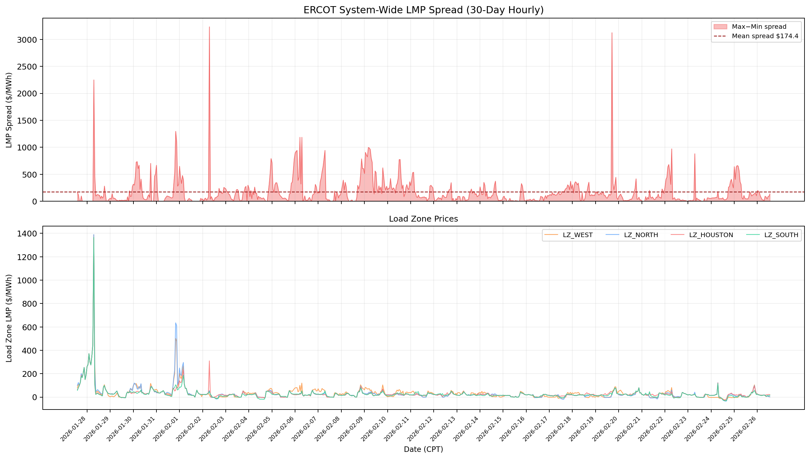
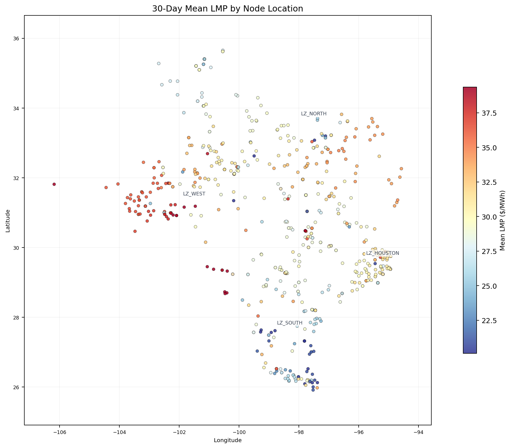
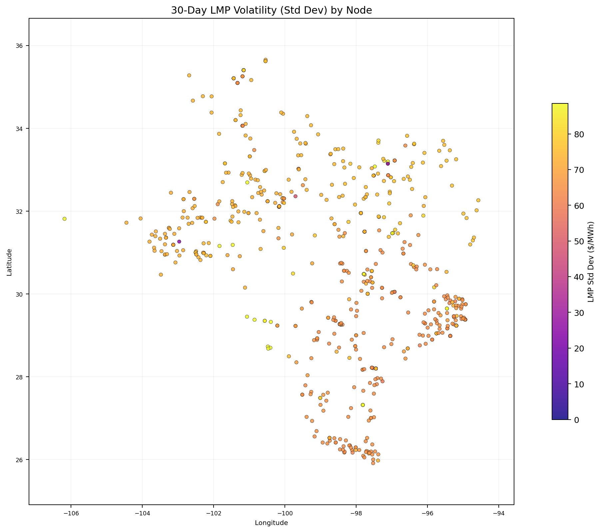
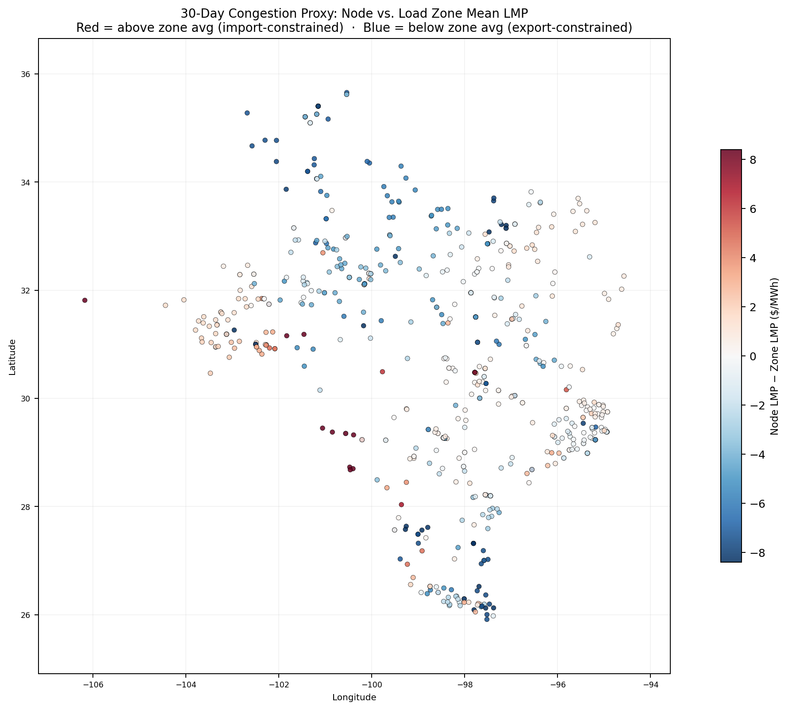
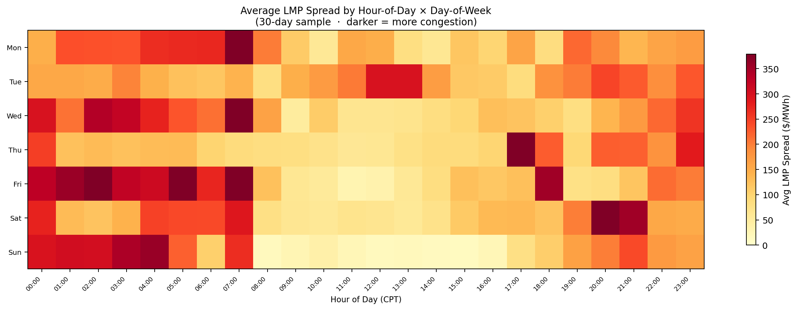
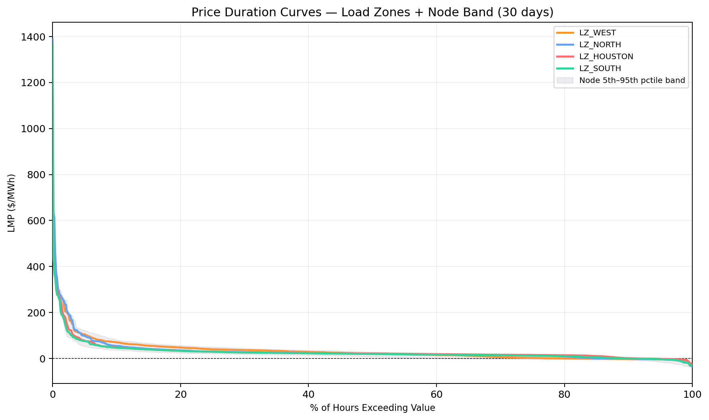
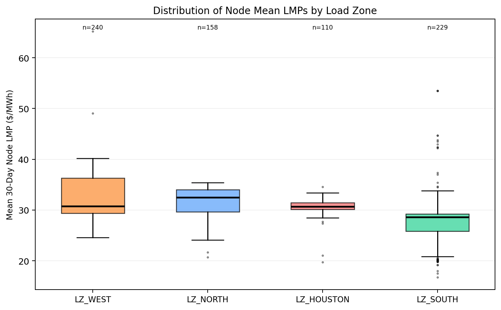
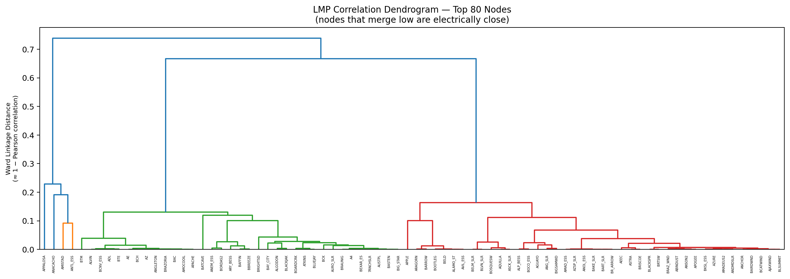
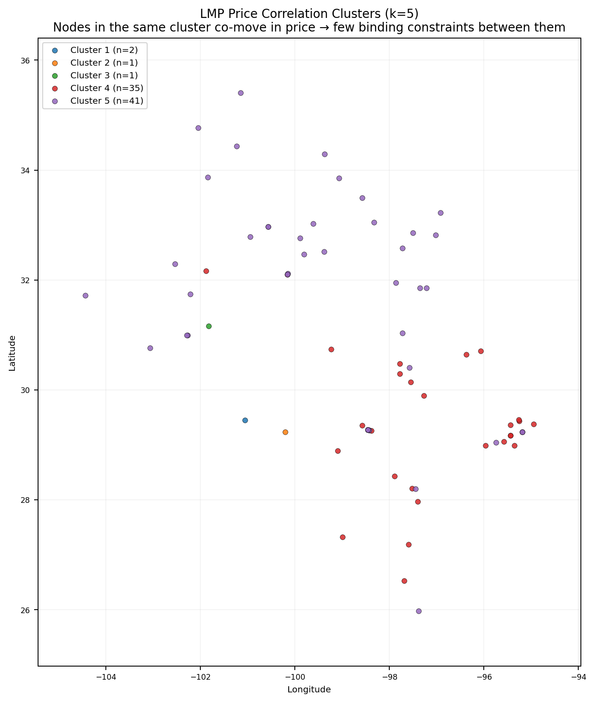

# ERCOT LMP Congestion Analysis

**Generated:** 2026-02-26 16:43 CPT  
**Data window:** 2026-01-27T14 → 2026-02-26T13 (CPT, hourly SCED snapshots)  
**Nodes with LMP + coordinates:** 737  
**Total hourly snapshots:** 720

---

## Key Findings

- **Mean system LMP spread** over the period: **$174.44/MWh**  
  *(spread = max − min LMP across all resource nodes per hour)*

- Load zone price ordering (cheapest → most expensive on average):

  - `LZ_SOUTH`: $28.52/MWh avg

  - `LZ_AEN`: $28.86/MWh avg

  - `LZ_LCRA`: $29.01/MWh avg

  - `LZ_CPS`: $29.26/MWh avg

  - `LZ_HOUSTON`: $31.05/MWh avg

  - `LZ_NORTH`: $33.25/MWh avg

  - `LZ_RAYBN`: $33.92/MWh avg

  - `LZ_WEST`: $34.77/MWh avg


### Most Import-Constrained Nodes
*(mean LMP far above their load zone average — likely at the receiving end of a binding transmission constraint)*

| Node | Load Zone | Mean LMP | Zone Avg | Congestion Premium |
|------|-----------|----------|----------|--------------------|
| RUSSEKST | LZ_WEST | $65.22 | $34.77 | +$30.45 |
| AMISTAD | LZ_SOUTH | $53.49 | $28.52 | +$24.96 |
| HAMILTON | LZ_SOUTH | $53.49 | $28.52 | +$24.96 |
| TSECA_ES | LZ_SOUTH | $53.49 | $28.52 | +$24.96 |
| ANTL_ESS | LZ_SOUTH | $44.69 | $28.52 | +$16.17 |

### Most Export-Constrained Nodes
*(mean LMP far below their load zone average — generation that cannot fully export due to transmission limits)*

| Node | Load Zone | Mean LMP | Zone Avg | Congestion Discount |
|------|-----------|----------|----------|--------------------|
| SPNCER | LZ_NORTH | $20.69 | $33.25 | $-12.57 |
| LYNX_ESS | LZ_SOUTH | $16.78 | $28.52 | $-11.75 |
| CNLY_ESS | LZ_NORTH | $21.68 | $33.25 | $-11.58 |
| KEG | LZ_HOUSTON | $19.76 | $31.05 | $-11.29 |
| HNY_COMB | LZ_SOUTH | $17.53 | $28.52 | $-10.99 |

---

## Methodology

### What LMP Spread Tells Us About Line Capacity

In ERCOT's nodal pricing model, the **Locational Marginal Price (LMP)** at each settlement point is:

```
LMP = Energy Component + Congestion Component + Loss Component
```

When a transmission line reaches its thermal limit, the optimal power flow model assigns a **shadow price** to that constraint. This shadow price flows directly into the LMPs: nodes on the *import* side of the constraint pay more (to incentivise demand reduction or local generation), while nodes on the *export* side receive less (to incentivise more generation or demand increase).

Therefore:

- `LMP(A) − LMP(B) > 0` consistently → the path A→B is likely constrained, with the line carrying power from cheap B to expensive A

- A **high standard deviation** in `LMP(node)` over time indicates a node near a constraint that binds intermittently (e.g., only during peak hours or high-wind periods)

- The **congestion proxy** (`node_mean_LMP − zone_mean_LMP`) isolates the geographic component from the system-wide energy price

- **Correlation clusters** reveal groups of nodes that are electrically cohesive — few binding constraints exist *within* a cluster, but the boundaries between clusters are likely where constraints bind


---

## Figures

### Fig 01 System Spread



**Fig 1 — System LMP Spread Time Series.** Top panel: hourly max−min spread across all resource nodes. Bottom panel: the four load zone prices. Spikes correspond to real congestion events; the dashed line is the 30-day mean spread.

### Fig 02 Mean Lmp Map



**Fig 2 — 30-Day Mean LMP by Node.** Geographic distribution of time-averaged prices. Red = expensive; blue = cheap. Persistent geographic gradients indicate recurring transmission barriers.

### Fig 03 Volatility Map



**Fig 3 — LMP Volatility Map (Std Dev).** High-volatility nodes (bright yellow) are near intermittently-binding constraints — they swing between cheap and expensive depending on load and dispatch.

### Fig 04 Congestion Proxy Map



**Fig 4 — Congestion Proxy Map.** Each node's mean LMP minus its load zone's mean LMP. Red nodes are systematically more expensive than their zone (import-constrained); blue nodes are systematically cheaper (export-constrained, typically generation-heavy areas with limited takeaway capacity).

### Fig 05 Temporal Heatmap



**Fig 5 — Temporal Congestion Heatmap.** Average LMP spread by hour-of-day and day-of-week. Darker cells = more congestion. Visible patterns: afternoon peaks (high load), overnight lows (abundant wind), and weekday vs. weekend differences.

### Fig 06 Price Duration Curves



**Fig 6 — Price Duration Curves.** Fraction of hours at or above each price level, by load zone. The gap between zone curves shows inter-zonal congestion; the shaded band covers the 5th–95th percentile of all individual node prices.

### Fig 07 Zone Boxplots



**Fig 7 — Node LMP Distribution by Load Zone.** Spread within each zone shows intra-zonal congestion. Zones with wide distributions have more internal constraints.

### Fig 08A Dendrogram



**Fig 8a — LMP Correlation Dendrogram.** Hierarchical clustering of node price timeseries. Nodes that merge at low height are highly correlated (electrically close). Tall merges reveal transmission barriers.

### Fig 08B Cluster Map



**Fig 8b — LMP Correlation Cluster Map.** Geographic assignment of the five correlation clusters. Cluster boundaries approximate the locations of recurring transmission constraints.


---

## Data Provenance

- LMP data: ERCOT Public API, report NP6-788-CD (`lmp_node_zone_hub`), one SCED interval per hour

- Node coordinates: `grid_data/matching_results/texas_matched_substations_v6.csv`, OSM + EIA-860 multi-pass fuzzy matching

- Analysis code: `Realist/reports/congestion_analysis.py`

- Raw data cache: `Realist/reports/data/lmp_history.csv`
